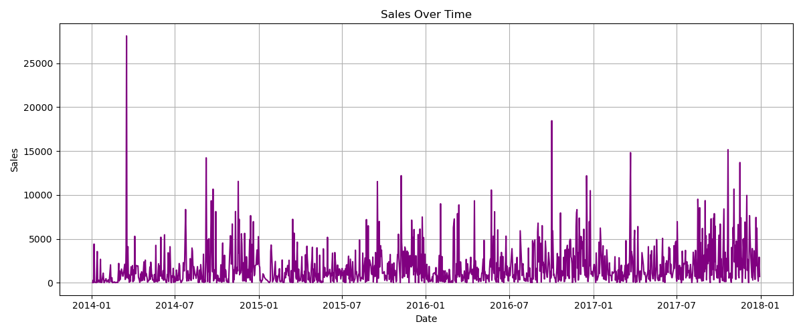

# Sales Data Analysis & Prediction using Python

## Project Overview
This project focuses on performing end-to-end sales data analysis and basic predictive modeling using Python. It includes data preprocessing, exploratory data analysis (EDA), visualization, and a machine learning model to classify sales performance.

---

## Objective
- Perform numerical analysis using NumPy  
- Clean and preprocess data using Pandas  
- Visualize insights using Matplotlib  
- Build a basic machine learning model for sales prediction

---

## Dataset
This project uses a publicly available sales dataset from Kaggle.

🔗 Kaggle Dataset: https://www.kaggle.com/datasets/vinothkannaece/sales-dataset

The dataset contains:
- Order Date  
- Product Name  
- Sales  
- Region  
- Category and Sub-category  

**Data Enhancement**  
To simulate real-world scenarios:
- Missing values were intentionally introduced and handled  
- Duplicate records were created and removed  

---

## Tools & Technologies
- Python  
- NumPy  
- Pandas  
- Matplotlib
- Scikit-learn  
- Jupyter Notebook  

---

## Key Features

### Data Cleaning
- Handled missing values using mean and placeholders  
- Removed duplicate rows  
- Converted date columns to datetime format  

### Data Analysis
- Computed total sales  
- Analyzed sales by product and region  
- Identified best-selling product  
- Detected lowest-performing region  
- Calculated average sales per product 

### Visualization
- Bar Chart (Top 10 Products by Sales)  
- Pie Chart (Sales Distribution by Region)  
- Line Chart (Sales Over Time)  
- Subplots (Combined multiple charts)  

---

## Time-Based Analysis
- Extracted month and day from date  
- Calculated monthly sales  
- Identified peak sales month  
- Plotted monthly sales trend  

---
##  Machine Learning (Bonus Enhancement)

### Model: Logistic Regression
- Created a binary target: High Sales vs Low Sales  
- Performed feature encoding using one-hot encoding  
- Split dataset into training and testing sets  
- Trained model using Logistic Regression  

### 📊 Model Performance
- Accuracy: **~84%**  
- Evaluated using:
  - Confusion Matrix  
  - Classification Report  

---

##  Sample Outputs

### Bar Chart


### Pie Chart


### Monthly Trend


---

## Project Structure

Sales-Data-Analysis/

├── Sales_Analysis.ipynb

├── Sales_dataset.csv

├── cleaned_sales.csv

├── sales_by_product.png

├── sales_by_region.png

├── monthly_sales.png

├── all_charts.png

├── README.md

---
## ▶️ How to Run the Project

1. Clone or download the repository  
2. Open the project folder  
3. Install required libraries:
   ```bash
   pip install numpy pandas matplotlib scikit-learn
4. Open the Jupyter Notebook:
   3. Install required libraries:
   ```bash
   jupyter notebook
5. Run all cells in Sales_Analysis.ipynb

---

## Conclusion
This project demonstrates how raw sales data can be transformed into meaningful insights through data cleaning, analysis, and visualization. The addition of a machine learning model enhances the project by introducing predictive capabilities, making it closer to real-world data science applications.

---

## Author
Venkata Durga Bhavani Kalla
