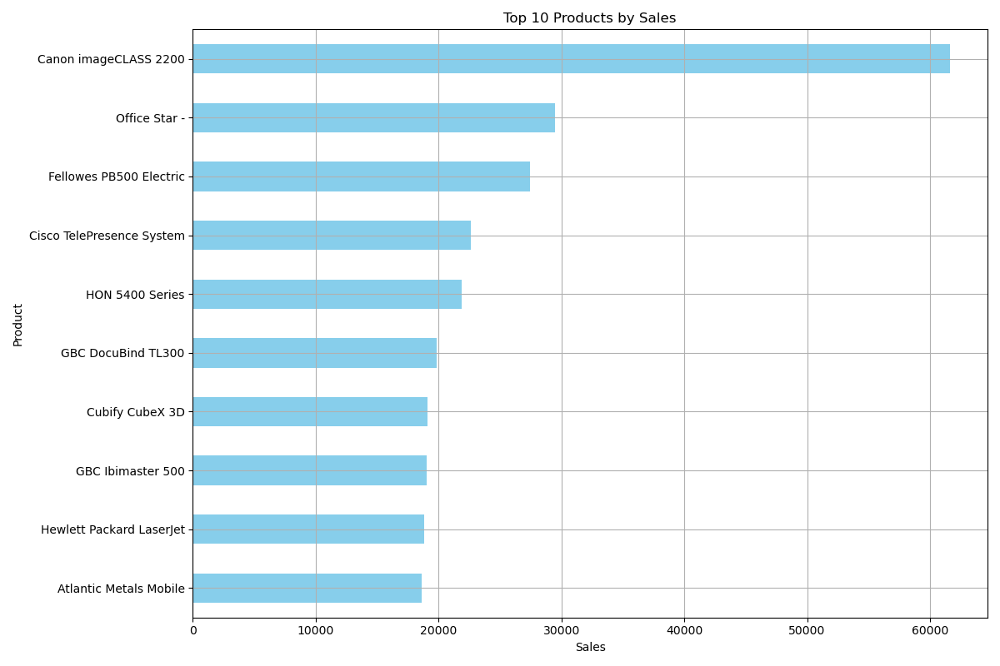
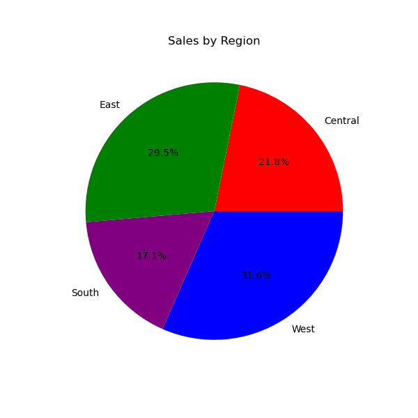

# Sales Data Analysis using Python

## Project Overview
This project focuses on analyzing sales data using Python libraries such as NumPy, Pandas, and Matplotlib. It includes data cleaning, analysis, and visualization to extract meaningful insights.

---

## Objective
- Perform numerical analysis using NumPy  
- Handle and clean data using Pandas  
- Visualize data using Matplotlib  

---

## Dataset
The dataset contains:
- Date  
- Product Name  
- Sales  
- Region  

Missing values and duplicate rows were intentionally introduced for data cleaning practice.

---

## Tools & Technologies
- Python  
- NumPy  
- Pandas  
- Matplotlib  
- Jupyter Notebook  

---

## Key Features

### Data Cleaning
- Handled missing values  
- Removed duplicate rows  
- Converted date format  

### Data Analysis
- Total sales calculation  
- Sales by product and region  
- Best-selling product identification  
- Monthly sales trend analysis  

### Visualization
- Bar Chart (Top Products)  
- Pie Chart (Sales by Region)  
- Line Chart (Sales Over Time)  
- Combined Subplots  

---

## Time-Based Analysis
- Extracted month and day  
- Calculated monthly sales  
- Identified highest sales month  

---

## 📷 Sample Outputs

### Bar Chart

### Pie Chart

### Monthly Trend

---

## Project Structure

Sales-Data-Analysis/

├── Sales_Analysis.ipynb

├── Sales_dataset.csv

├── cleaned_sales.csv

├── sales_by_product.png

├── sales_by_region.png

├── monthly_sales.png

├── all_charts.png

├── README.md

---

## How to Run

1. Download the project as ZIP from GitHub  
2. Extract the files  
3. Open the notebook file (Sales_Analysis.ipynb) in Jupyter Notebook or Google Colab  
4. Run all cells step by step

---

## Conclusion
This project demonstrates how Python can be used for data cleaning, analysis, and visualization to gain insights from sales data.

---

## Author
Venkata Durga Bhavani Kalla
